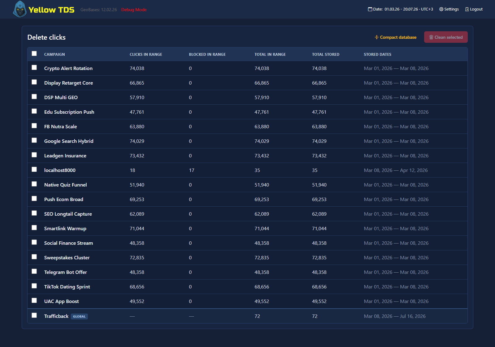

# Admin Panel

## Main Pages

- `admin/index.php` — campaigns dashboard
- `admin/campsettings.php` — campaign settings
- `admin/statistics.php` — statistics tables
- `admin/clicks.php` — click logs
- `admin/database.php` — statistics cleanup and SQLite maintenance

## Main Capabilities

- manage campaigns
- configure traffic logic
- inspect statistics
- inspect click data
- manage folders and files
- scroll the campaign list within the available dashboard height
- view free disk space and the SQLite database, cache, and log sizes in the action bar above the table

The **DB** size includes the main SQLite file and its WAL/SHM sidecar files. Click the indicator to open database maintenance. **Cache** covers the complete configured cache directory, including uploaded landing and safe pages. Values are recalculated at most once per minute so large directories do not slow down the Dashboard. Free disk space is highlighted in yellow below 15% and red below 5%.

The **Settings** button opens [system settings](system-settings.md), plugin controls, and update actions. The **Logs** status item opens the [server log viewer](testing-and-diagnostics.md#server-logs). The GeoBases date in the header is informational.

## Delete Clicks

The **DB** page lists each campaign with click and blocked-record counts for the header date range and for all stored data. Trafficback is the final row of the same table and is marked **GLOBAL**.

One or several rows can be selected, and **Select all** includes Trafficback. Cleanup removes clicks, status and payout snapshots, conversion history, aggregated events, associated funnel steps and event history, plus matching blocked records. Campaign settings, `common`, files, cache, and server logs remain untouched.

YellowTDS recounts the selection and warns about recent traffic before starting. No automatic backup is created: type `DELETE` to confirm the irreversible operation. Records are removed in batches of 1,000 clicks. Closing the page stops between batches, and reopening it offers to resume. Clicks received after the cleanup starts are not added to that operation.

After deletion, YellowTDS automatically checkpoints and runs `VACUUM`, then reports the database size before and after. VACUUM can block statistics writes, so run maintenance during a low-traffic window. If disk space is insufficient or compaction is interrupted, deletion remains complete and **Retry compaction** retries VACUUM only. **Compact database** runs compaction without deleting statistics.

## File Management

The **Add Existing** action opens a searchable checkbox list, so several safe-page or landing folders can be added at once. Selections persist while filtering. In long lists only the folder area scrolls, while search and the **Cancel** / **Add selected** buttons remain available.

Selected folder names are displayed as fixed identifiers and do not receive mouse or Tab focus. Redirect, CURL, and HTTP-code fields remain editable.
