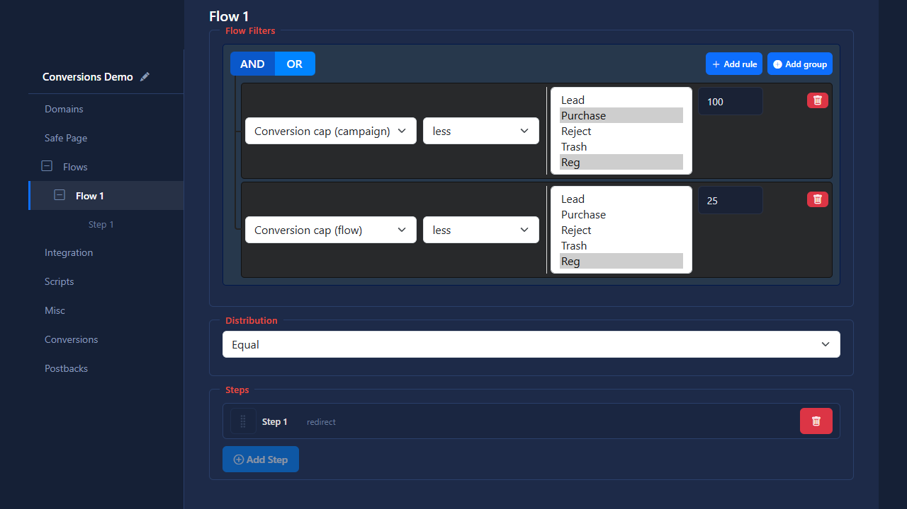
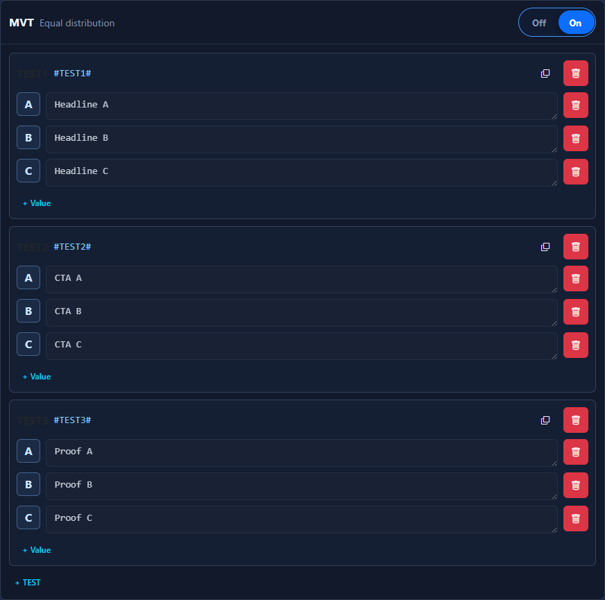

# Black Settings and Flows

## Main Areas

- JS Connect action
- JS bot detection
- flows

## Flows

A flow contains:

- name
- filters
- steps
- distribution
- optimization settings

Flows are evaluated in order. Drag the handle to the left of a flow name to reorder it. When the handle has keyboard focus, `↑` and `↓` provide the same control.

When [uniqueness counting](uniqueness.md) is enabled, flow filters include Campaign and Flow uniqueness conditions. Safe Page never exposes this filter.

The **Bot** filter uses DeviceDetector's server-side User-Agent classification and accepts **Yes** or **No**. It runs before browser checks and does not replace the separate **JS bot detection** stage. When a Safe Page rule blocks a bot, Blocked clicks keeps reason `bot` and the complete original User-Agent.

Every flow also has two separate daily conversion rules:

- **Conversion cap (campaign)** counts all accepted history rows for the selected statuses across the campaign.
- **Conversion cap (flow)** counts only rows attributed to the current flow.

Choose one of `<`, `<=`, `=`, `!=`, `>=`, or `>`, one or more campaign statuses, and a numeric value. Counts include accepted paid-repeat or upsell rows. A day is bounded by the campaign timezone and always uses conversion-row time, independent of the statistics attribution setting. When a flow no longer matches its cap rule, YellowTDS evaluates the next flow and then TrafficBack.

## Steps

Steps use the same handle to keep ordering consistent. A redirect is a terminal action, so its step remains locked in the last position.

Each step can contain folders or redirect URLs. Weight is stored with the corresponding folder or URL. A folder also stores its load type and its own MVT settings.

## Landing MVT

Every folder entry has an **MVT** section. Put its generated placeholder, such as `#TEST1#`, into the landing HTML and add text or HTML Values to the TEST. YellowTDS selects one Value independently and uniformly for every active TEST and performs a trusted string replacement. The same placeholder may occur more than once in the HTML.

TEST numbers follow creation order. Values use A, B … Z, AA, and subsequent codes. A saved Value is read-only: archive it and append another Value when the content must change. Archived TESTs and Values stay in the configuration with their original number or code, so numbering never rolls back.

One `clickid + step` always keeps the same landing and MVT combination. A new click first reuses the current PHP-session assignment. When **Save user path** is enabled, the existing `saved_paths` cookie provides a five-day fallback. Direct Load refreshes and Back navigation read the assignment already recorded for the reached step instead of selecting again.

Only active TESTs and Values participate in new assignments. A previously assigned archived Value continues to render for an existing click, session, or Sticky path while MVT remains enabled. When MVT is disabled, YellowTDS does not replace placeholders and does not scan or repair the landing HTML.
