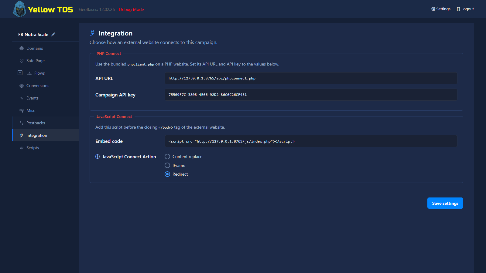

# Campaign Settings

## Main Sections

The campaign settings page includes:

- Domains
- Safe Page
- Flows
- Conversions
- Events
- Misc
- Postbacks
- Integration
- Scripts

The campaign name is shown at the top of the sidebar. Use the pencil icon beside it to rename the campaign without returning to the dashboard. Compact icons beside the primary navigation items repeat the icons used in their section headings; nested flows and steps remain text-only.

Every primary section starts with a consistent icon, title, and one-line description of its scope. These introductions are navigation aids; they do not change how campaign settings are saved.

All editor sections use one full-size treatment for text actions. Icon-only actions use the same height as the step controls, including rows added without reloading the page.

## Domains

The **Domains list** group contains every campaign domain. Each row shows its check result and keeps the delete button aligned with the domain field.

Domains are stored in lowercase without a scheme or path. A hostname, IP/`localhost`, and an optional port are supported. A wildcard is allowed only at the beginning: `*.example.com` matches `a.example.com` and `a.b.example.com`, but not the `example.com` apex. Overlapping rules across campaigns are rejected and the editor names both conflicting campaigns. New and duplicated campaigns start with an empty domain list.

On save, YellowTDS automatically writes `caching/runtime/domains.php` and the complete campaign settings to `caching/runtime/campaign-<id>.php`. Runtime includes these PHP files directly. If the domain index or the selected campaign file is missing or unreadable, the request falls back to the normal SQLite lookup; the next campaign save recreates the full set.

## Safe Page

Defines what blocked or filtered traffic receives. The `−/+` control beside **Safe Page** collapses or expands the domain-specific pages in the sidebar. It appears as soon as Domain-Specific mode is selected, and navigating to a domain page expands the branch automatically.

## Flows

Defines the black branch routing for allowed traffic.

**Save user path (Sticky)** and **JS Bot Detection** use explicit On/Off switches. Save user path reuses the same step variants when the visitor returns to a previously visited flow; flow matching itself still runs on every visit. JS Bot Detection settings appear only while its switch is On; the extra framed group is no longer used.

Flows and steps use the same drag handle to the left of their names. The previous up/down arrow controls are no longer used.

Use the `−/+` control beside **Flows** to collapse or expand the whole tree. The same control beside an individual flow affects only its steps. Tree state is saved per campaign, and navigating to a hidden step expands its branch automatically.

## Integration

Campaign launch methods are collected on one screen:

- **PHP Connect** shows the `api/phpconnect.php` URL and the campaign API key used by the bundled `phpclient.php`.
- **JavaScript Connect** shows the ready-to-embed `<script>` tag and controls whether the routed page replaces the current content, opens in an iframe, or redirects the browser.

JavaScript Connect Action is a campaign-wide integration setting and is no longer shown under Flows.

## Scripts

Backfix, redirects, and image lazy loading use the same explicit **Off/On** switches as the campaign-wide flow options. Feature-specific fields appear only while the corresponding switch is On.

## Events

This section configures enabled scroll-depth and visible-time thresholds plus the allowlist for custom browser events. Only those enabled `scroll_*`, `stay_*`, and custom events are available in the **Events** searchable chip field of an S2S rule. Performance/RUM metrics are not S2S events. See [Events](events.md) for collection semantics.

## Misc

The **Misc** section contains **Uniqueness counting**, its identifier method and sliding TTL, plus the campaign timezone used by reports and daily conversion caps. Timezone options retain their IANA identifier and show the current UTC offset, for example `Europe/Samara (UTC+04:00)`; the offset can change with daylight-saving rules. The timezone selector in the statistics header edits this same value. See [Uniqueness Counting](uniqueness.md) for identifier, flow-filter, cookie, GET-array, and statistics behavior.

## Conversions

This section contains the campaign status catalog, transaction-ID deduplication, the comma-separated transaction ID parameter names accepted from different affiliate programs, successful-form conversion settings, and the optional website helper. See [Conversions and Postbacks](postbacks.md).

## Postbacks

The Postbacks section contains Key protection and outgoing S2S rules. With **Key protection** enabled, an incoming postback must include `pbkey`; list accepted values as comma-separated entries in **Allowed key values**. Rejected postbacks are masked as `404 Not Found` outside Debug Mode.

Each S2S rule has two searchable chip fields: **Conversion statuses** from the Conversions catalog and **Events** from enabled scroll/time/custom browser events. They use OR semantics: any selected status or event is enough to run the rule. See [Conversions and Postbacks](postbacks.md) for macros, one-time browser-event delivery, and fire-and-forget behavior for event-triggered S2S only.
