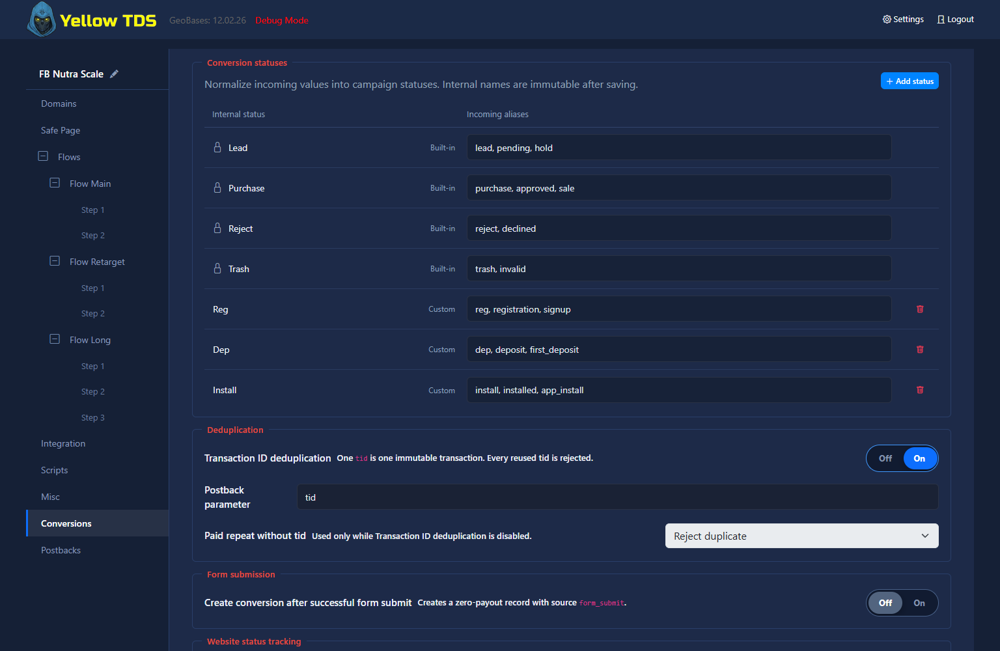
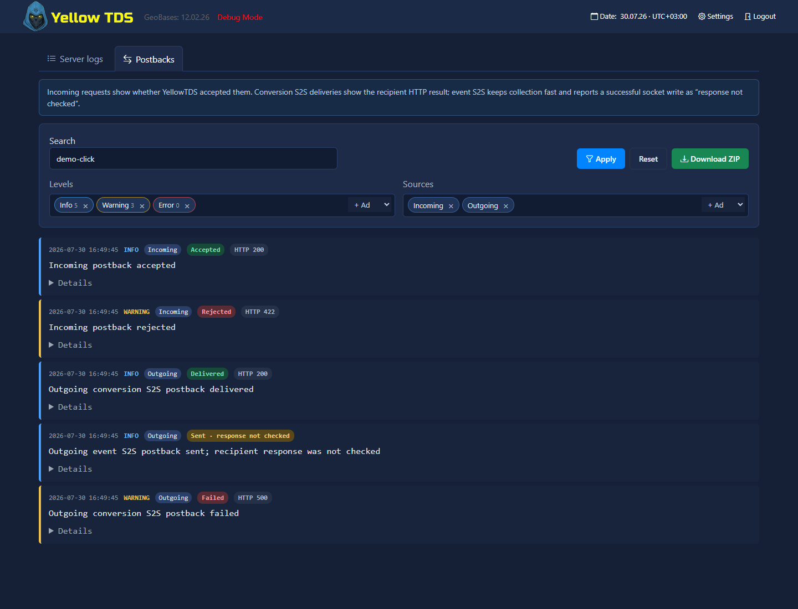

# Conversions and Postbacks

## Campaign Status Catalog

The **Conversions** section in Campaign settings contains the campaign-wide status catalog. Every row has:

- an immutable internal name used by YellowTDS;
- comma-separated incoming aliases.

Matching is case-insensitive. A name or alias can belong to only one status. Lead, Purchase, Reject, and Trash cannot be renamed or deleted, but their aliases can be changed. Custom statuses such as Reg, Dep, or Install can be added without a fixed limit.

Deleting a custom status shows its current and historical uses before confirmation. Existing click snapshots, conversion history, and saved report definitions remain intact; the deleted name and aliases are no longer accepted as incoming values.



## Incoming Postback

Send a request to `api/postback.php` with:

- `clickid` — required click identifier;
- `status` — required internal name or alias;
- `payout` — optional non-negative number, default `0`;
- `currency` — optional three-letter code, default `USD`;
- `tid` — optional transaction identifier; this is the default parameter name and can be changed or extended in **Conversions → Transaction ID parameters**;
- `pbkey` — required only when campaign **Key protection** is enabled.

Example:

```text
/api/postback.php?clickid={sub1}&status={status}&payout={payout}&currency=USD&tid={transaction_id}&pbkey=secret
```

**Transaction ID parameters** accepts up to 32 comma-separated names, for example `tid, order_id, transaction_id`. Names contain ASCII letters, numbers, underscores or hyphens, start with a letter or underscore, and cannot replace the core `clickid`, `status`, `payout`, `currency`, or `pbkey` fields. Each name is a separate deduplication namespace, so `order_id=123` and `transaction_id=123` can represent transactions from different affiliate programs.

Send at most one non-empty configured transaction ID parameter in a postback. Empty configured values are ignored; multiple non-empty names, array values, control characters, or a parameter duplicated between the query string and POST body are rejected. GET and form POST are supported explicitly; cookies are never read as postback parameters.

The first accepted status is the clickid's initial conversion. Later status changes are stored in history but do not increase the base **Conversions** metric. `clicks.status` is the latest accepted status and `clicks.payout` is cumulative revenue. The raw incoming status is retained in history for diagnostics.

Unknown statuses are rejected and written to the warning log. When **Key protection** is enabled, any rejected postback is returned as a generic `404 Not Found` unless Debug Mode is enabled. Without Key protection, YellowTDS always returns the actual JSON result.

## Duplicate Transactions and Paid Repeats

When Transaction ID deduplication is enabled, a transaction ID can be used only once within the configured parameter that received it. A paid repeat of the current status requires a new transaction ID in that namespace; status or payout correction by reusing a prior ID is not supported. A repeat of the current status without payout is always rejected.

When deduplication is disabled, **Paid repeat without transaction ID** controls a paid repeat of the current status:

- **Reject duplicate** — reject it; this is the default.
- **Accept as upsell** — append another history row and add its payout.

## Other Conversion Sources

The same resolver and history writer are used for all sources:

- **Successful proxied form** optionally creates a zero-payout status; the default selected status is Lead.
- **Website status tracking** injects `ytdsConversion(status)` into routed pages. It uses the current clickid, accepts an internal name or alias, and never accepts payout.

```javascript
ytdsConversion('Reg').then(console.log).catch(console.error);
```

## Outgoing S2S Postbacks

Each S2S rule in **Postbacks** has a URL, a `GET` or `POST` method, and two independent searchable fields: **Conversion statuses** and **Events**. Selected values appear as chips and can be found by typing, added, or removed without changing the rest of the rule.

- **Conversion statuses** contains internal statuses from the Conversions catalog. For a conversion, `{status}` in the URL is replaced with that normalized internal status.
- **Events** contains only enabled browser events: configured `scroll_*` and `stay_*` thresholds plus allowed custom events. Performance/RUM metrics are not S2S events and do not appear in this field.

The selections use **OR** semantics: a rule runs when any selected conversion status **or** any selected event occurs. A rule with both fields empty does not run. Each accepted history row, including an accepted paid repeat, can trigger a selected conversion status.

A browser-event delivery can happen only once for a `clickid + step + event` combination. Repeated scroll crossings, visible-time threshold hits, or custom-event calls do not create another S2S delivery for that same combination.

### Macros

Conversion-triggered S2S URLs support `{clickid}`, `{userid}`, `{domain}`, `{status}`, and click-parameter `c.*` macros where configured in the URL. `{status}` is replaced with the normalized internal status name.

Browser-event-triggered S2S URLs support `{clickid}`, `{userid}`, `{domain}`, `c.*`, plus `{event}`, `{event_value}`, `{step_index}`, `{variant}`, and `{trigger_type}`. `{status}` belongs only to conversion-triggered delivery.

### Delivery and Event Trust

Browser-event-triggered S2S is sent in fire-and-forget mode: YellowTDS writes the HTTP request to a write-only socket and does not wait for the partner's HTTP response. These deliveries have no queue, retries, or delivery guarantee; an unavailable server, network error, or a partner response after the write is not retried automatically. Conversion-status S2S remains an ordinary confirmed delivery. Use event-triggered S2S for best-effort notifications, not as the only confirmation of a financial conversion.

Browser events originate on the visitor's page and are untrusted engagement signals. Do not treat them as protected proof of payment, fraud prevention, or a server-side status; select them for S2S only where this best-effort meaning is acceptable.

## Postback Log

Select **Logs** on the dashboard, then open the **Postbacks** tab. One chronological stream contains:

- every incoming `api/postback.php` result: `Accepted` or `Rejected`, HTTP code, campaign, click ID, incoming and normalized status, payout, currency, and result code;
- every conversion S2S attempt: `Delivered` only for a `2xx` response, otherwise `Failed`, with the method, final URL, HTTP code, transport error, and a shortened response body;
- every event S2S attempt: `Sent · response not checked` after the full request is written to the socket, or `Failed` when connection or writing fails.



Use **Levels** and **Sources** to keep only incoming or outgoing records. Search covers click IDs, statuses, URLs, and responses. **Download ZIP** exports the filtered JSON Lines records plus a filter manifest.

`Sent · response not checked` does not mean the partner accepted an event S2S request: the fast event transport intentionally does not wait for its HTTP response. For conversion S2S, `Delivered` means a successful `2xx` HTTP response, not independent confirmation of the business result in the partner system.
