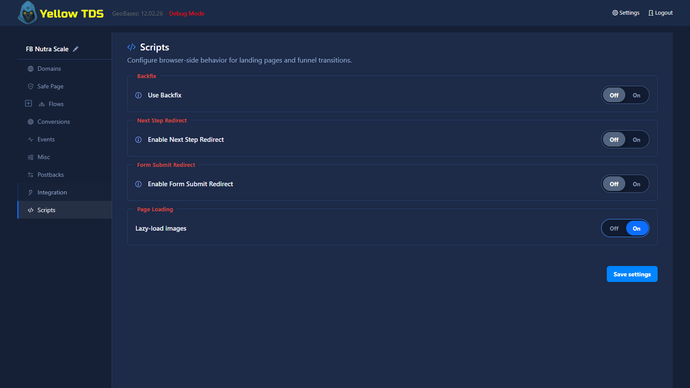

# Scripts

## Purpose

The Scripts section controls additional page and funnel behavior.

## Main Options

- **Backfix** — optionally opens one of the configured fallback URLs when the visitor tries to return to the previous page.
- **Next Step Redirect** — redirects the current tab after opening the next step in a new tab.
- **Form Submit Redirect** — redirects the current tab after a terminal-step form is submitted.
- **Page Loading** — optionally enables lazy loading for images.

Every binary setting uses the same **Off/On** switch. Fields that belong to a feature are shown only while its switch is On. Saving still writes one boolean value for each setting.

Conversion tracking is configured separately under **Conversions**. A successful proxied terminal form can create a selected zero-payout status, and optional Website status tracking injects the `ytdsConversion(status)` helper. Both use the same campaign catalog and conversion history as an incoming postback.

Scroll, visible-time, performance, and custom browser events are configured separately under [Events](events.md).
