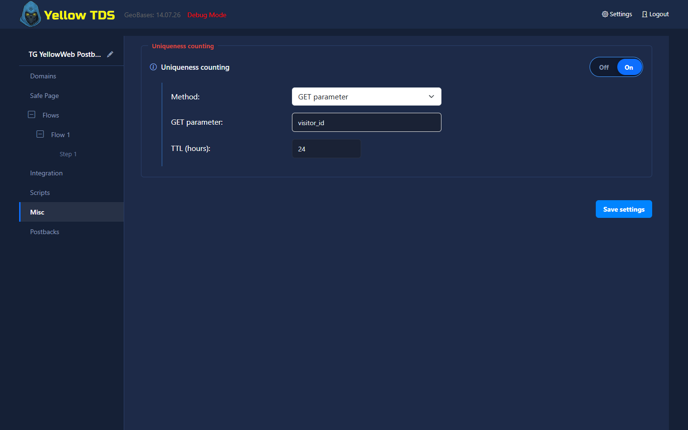

# Uniqueness Counting

## Enabling the Feature

Open **Campaign settings → Misc → Uniqueness counting**. While disabled, YellowTDS does not calculate uniqueness, does not create the `userid` cookie, and does not show the **Uniqueness** filter in flows.

When enabled, configure:

- **Method** — the visitor identifier;
- **TTL (hours)** — a sliding window from 1 to 720 hours;
- **GET parameter** — the parameter name used by the GET method.

Every successfully recorded flow click receives both results:

- **Campaign unique** — no matching click exists in the campaign within the TTL;
- **Flow unique** — no matching click exists in the selected flow within the TTL.

Both values are calculated even when no flow uses a uniqueness filter. Safe Page, the JS check before flow entry, trafficback, requests without a selected flow, and rolled-back clicks do not participate.

## Methods

| Method | Visitor lookup |
|---|---|
| IP | canonical IP address |
| IP + UserAgent | canonical IP and the full UserAgent |
| Cookie | `userid` cookie |
| Cookie / IP | cookie when present, otherwise IP |
| Cookie / IP + UserAgent | cookie when present, otherwise IP and full UserAgent |
| GET parameter | canonical value of the configured GET parameter |

Combined cookie methods always store the fallback hash. When a cookie is present, only `userid` is checked. If the cookie is lost, the following request uses the fallback.

The `userid` cookie is created only for the three cookie methods. It lasts 30 days and is refreshed after a recorded click. It is host-only, `HttpOnly`, `SameSite=Lax`, and also `Secure` on HTTPS. Other methods store an empty userid and `{userid}` resolves to an empty string.

The GET method distinguishes strings and arrays. List order is preserved, while associative and nested map keys are sorted. Empty strings and empty arrays are values and are hashed. A missing parameter records no identity hash and treats the click as both Campaign unique and Flow unique.

## Sliding TTL

Every recorded flow click becomes the new last visit, including non-unique clicks. A match only counts when `click time > now - TTL`, so a click exactly on the TTL boundary is unique again.

With a 24-hour TTL, for example, a repeat after 20 hours is non-unique and moves the window forward by another 24 hours from that new click.

## Flow Filter

When counting is enabled, flow filters include **Uniqueness**:

- operator: **is unique** or **is not unique**;
- value: **Campaign** or **Flow**.

Flows are still evaluated from top to bottom and the first match wins. The filter is never available in Safe Page.

Counting cannot be disabled while a flow still contains a **Uniqueness** rule. The UI lists affected flows, and the backend checks the same condition again when settings are saved.

## Statistics

- **Uniques** sums Campaign unique clicks;
- **Flow uniques** sums unique entries into flows and does not require Group by Flow;
- **U/C**, **EPuC**, and **CPuC** use Campaign uniques.

Existing clicks are not backfilled. A group containing only legacy uncounted clicks, or a mixture of counted and uncounted clicks, shows `—` for uniqueness metrics.
