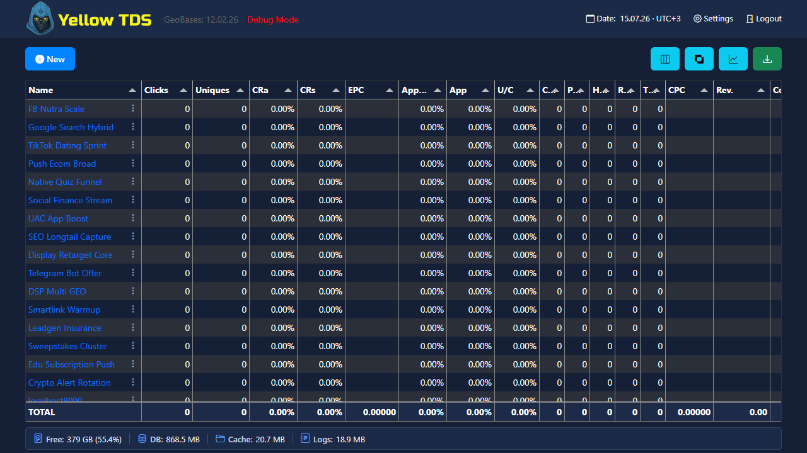

# Админ-панель

## Главные страницы

- `admin/index.php` — список кампаний и главная статистика
- `admin/campsettings.php` — настройки кампании
- `admin/statistics.php` — статистические таблицы кампании
- `admin/clicks.php` — просмотр кликов

## Dashboard

На главной странице доступны:

- список кампаний
- создание кампании
- trafficback URL
- экспорт таблицы
- настройка набора колонок
- внутренняя прокрутка списка кампаний при заполнении доступной высоты окна
- индикаторы состояния в панели действий над таблицей: свободное место на диске, размер SQLite-базы, каталога кэша и логов

Размер **DB** учитывает основной файл SQLite и его служебные WAL/SHM-файлы. **Cache** показывает весь настроенный каталог кэша, включая загруженные лендинги и safe pages. Значения пересчитываются не чаще одного раза в минуту, чтобы большие каталоги не замедляли открытие Dashboard. При остатке диска менее 15% индикатор становится жёлтым, менее 5% — красным.

Кнопка **Settings** открывает [системные настройки](system-settings.md), управление плагинами и обновлениями. Индикатор **Logs** открывает [просмотрщик серверных журналов](testing-and-diagnostics.md#серверные-журналы). Дата GeoBases в header носит информационный характер.

## Что хранится в UI

Админка управляет:

- columns layouts
- campaign settings JSON
- statistics tables
- filters and order by rules

## File management

Через админку можно:

- выбирать папки safe pages и лендингов
- редактировать файлы
- загружать ZIP

Кнопка **Add Existing** открывает окно с поиском и чекбоксами: за один раз можно отметить и добавить несколько папок. Выбор сохраняется при фильтрации списка. В длинных списках прокручивается только область папок, а поиск и кнопки **Cancel** / **Add selected** остаются на месте.

Названия выбранных папок отображаются как неизменяемые идентификаторы и не получают фокус мышью или клавишей Tab. Поля redirect, CURL и HTTP-кодов остаются редактируемыми.
