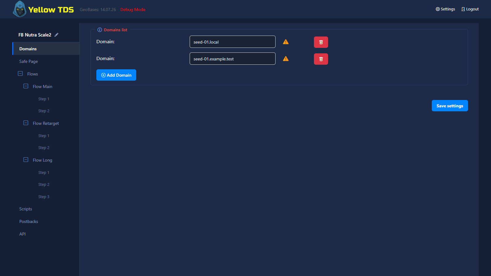
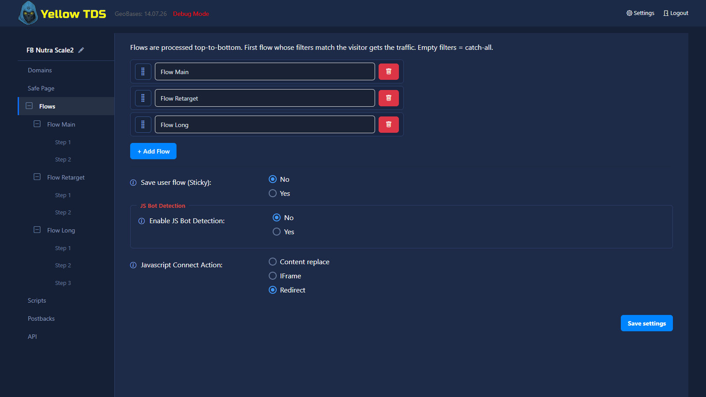

# Настройки кампании

## Основные разделы

На странице настроек кампании есть следующие крупные блоки:

- Domains
- White
- Flows
- Scripts
- Postbacks

Название кампании отображается в верхней части бокового меню. Значок карандаша справа от него позволяет переименовать кампанию, не возвращаясь на dashboard.

Во всех разделах редактора обычные кнопки действий имеют единый полный размер, а кнопки только с иконкой — ту же высоту, что элементы управления степами. Это правило сохраняется и для строк, добавленных без перезагрузки страницы.

## Domains

Здесь задаются домены, по которым runtime будет находить кампанию.

Группа **Domains list** содержит все домены кампании. В каждой строке рядом с доменом показывается результат проверки, а кнопка удаления расположена на одном уровне с полем домена.

## White

Этот блок определяет, что отдать нежелательному трафику:

- folder
- redirect
- curl
- error

Также здесь могут быть domain-specific white settings. Кнопка `−/+` возле пункта **Safe Page** в боковом меню сворачивает или разворачивает список доменов. Она появляется сразу после переключения в режим Domain-Specific; переход к странице конкретного домена автоматически раскрывает ветку.

## Flows

Это основная часть black-логики. В flow задаются:

- имя flow
- filters
- steps
- distribution
- optimize_for
- optimize_mode

Flows и steps сортируются перетаскиванием за одинаковую ручку слева от названия. Стрелки вверх/вниз для этого больше не используются.

Кнопка `−/+` возле пункта **Flows** сворачивает или разворачивает всё дерево, а такая же кнопка возле отдельного flow управляет только его steps. Состояние дерева сохраняется для каждой кампании; переход к скрытому step автоматически раскрывает нужную ветку.

## Scripts

Дополнительные механики:

- backfix
- replace transit or landing
- images lazy load
- redirect rules
- event tracking thresholds

## Postbacks

Здесь находятся:

- inbound status mapping
- outgoing S2S postbacks
