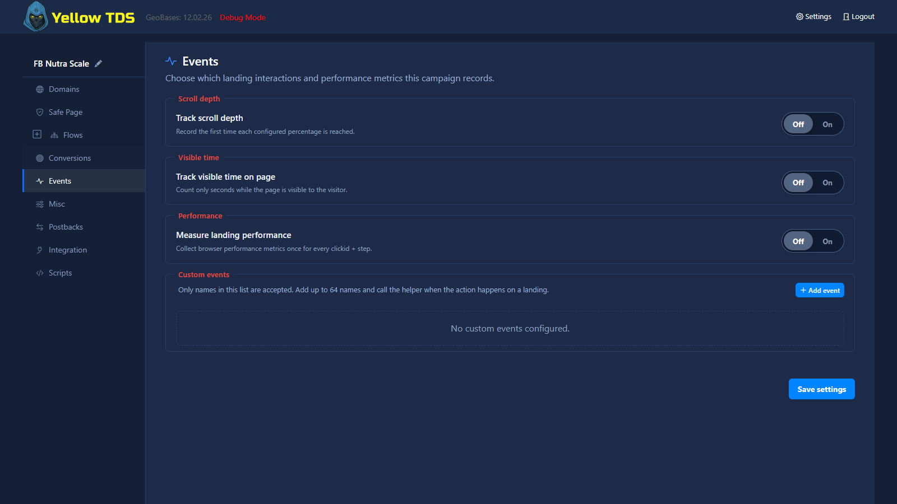

# Events

## Назначение

**Events** — отдельный раздел настроек кампании для браузерных событий вовлечённости и измерений реальной производительности страниц. У каждого сборщика есть собственный переключатель **Off/On**. YellowTDS добавляет только включённые сборщики и только в корневой `index.html` или `index.php` каждого шага. Вложенные страницы, iframe и другие файлы лендинга трекеры не получают.



## Глубина прокрутки

Включите отслеживание прокрутки и задайте до 32 целочисленных порогов глубины страницы от 1 до 100 процентов. Например, порог `50` создаёт событие `scroll_50`, когда посетитель впервые достигает половины страницы.

YellowTDS сохраняет первое возникновение для каждой пары clickid и step. Значение — время в миллисекундах от запуска трекера на этом шаге. Повторные пересечения того же порога его не заменяют.

## Видимое время

Включите отслеживание видимого времени и задайте до 32 целочисленных порогов от 1 до 86400 секунд. Например, порог `60` создаёт событие `stay_60s`, когда страница была видна 60 секунд.

Считается именно время видимости страницы, а не просто работа таймера в скрытой вкладке. Как и для событий прокрутки, YellowTDS сохраняет количество миллисекунд до первого возникновения события для каждой пары clickid и step.

## Измерение производительности

Переключатель **Measure landing performance** включает Real User Monitoring (RUM) через браузерные Performance API. YellowTDS собирает не более одного performance-измерения для каждой пары clickid и step. В интерфейсе это компактный переключатель: названия метрик доступны по наведению или фокусу на значке информации. В него могут входить:

| Метрика | Что означает | Единица |
| --- | --- | --- |
| **LCP** | Largest Contentful Paint: когда отрисован крупнейший видимый элемент контента | миллисекунды |
| **INP** | Interaction to Next Paint: насколько быстро страница отвечает на действие пользователя | миллисекунды |
| **CLS** | Cumulative Layout Shift: насколько сильно видимый контент неожиданно смещается | безразмерная оценка |
| **TTFB** | Time to First Byte: время до получения первого байта ответа | миллисекунды |
| **FCP** | First Contentful Paint: когда появился первый видимый контент | миллисекунды |

Сборщик хранит последние полученные значения и отправляет один snapshot через 10 секунд от начала документа. Если раньше начинается обычный переход по ссылке или отправка формы, YellowTDS сразу запускает отправку через keepalive-транспорт, не задерживая и не подменяя нативный переход браузера. Переход документа в состояние `hidden` служит аварийным fallback для Back, закрытия вкладки и ввода другого адреса.

Доступность метрик зависит от поддержки браузером и поведения посетителя. В пакет входят только реально полученные к моменту отправки значения. Например, визит без взаимодействия может не содержать INP; YellowTDS оставляет такую метрику отсутствующей, а не заменяет нулём. Включённые performance-метрики становятся доступны в отчётах кампании, но не добавляются в существующие отчёты автоматически.

Performance измеряется только в корневом index HTML/PHP-лендинга, в который YellowTDS может внедрить сборщик. Внутренние страницы и документы внутри iframe намеренно не измеряются. Для внешних редиректов измерение недоступно, а в JS Connect сборщик не внедряется: там navigation timing описывал бы документ-контейнер, а не выданный YellowTDS лендинг. Обычная HTML-выдача и PHP Connect поддерживаются.

## Пользовательские события

Список **Custom events** работает как allowlist максимум из 64 имён. Добавьте каждое имя, которое разрешено принимать в этой кампании. Справа от каждой строки находится кнопка **Copy**: она копирует готовый вызов с текущим именем, например:

```javascript
ytdsEvent('cta_click');
```

Вызовы с именами, которых нет в allowlist кампании, отклоняются. YellowTDS сохраняет только первое возникновение для каждой пары clickid и step — как количество миллисекунд от запуска трекера на этом шаге.

## Как читать значения

Значения событий прокрутки, видимого времени и custom events отвечают на вопрос: «через сколько времени после запуска трекера на этом шаге событие возникло впервые?». Чем меньше значение, тем раньше произошло первое срабатывание; отсутствие значения означает, что для этой пары clickid и step событие не было записано. Каждый запрос также содержит точный вариант лендинга, записанный для шага; несовпадающий вариант отклоняется.

Performance-значения — это сами браузерные измерения: временные метрики выражаются в миллисекундах, а CLS является безразмерной оценкой стабильности. Отсутствующие performance-значения остаются пустыми, чтобы не искажать отчёты.
