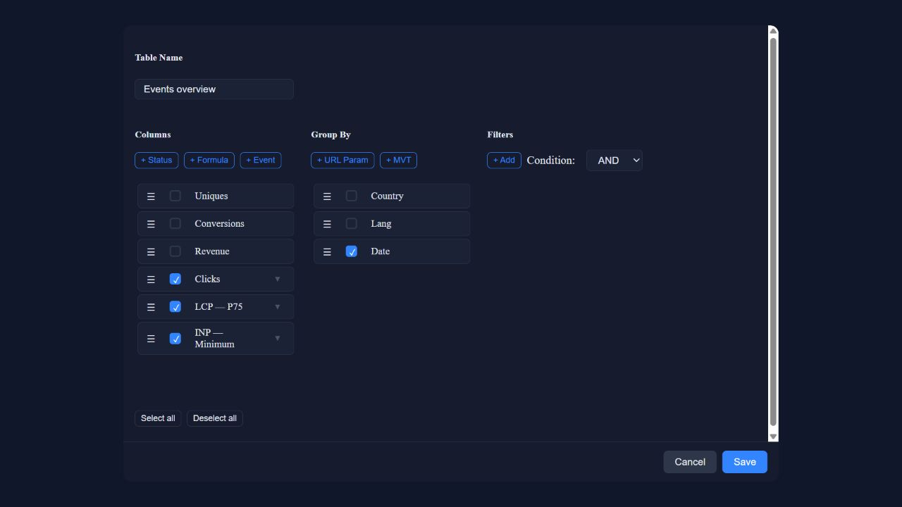
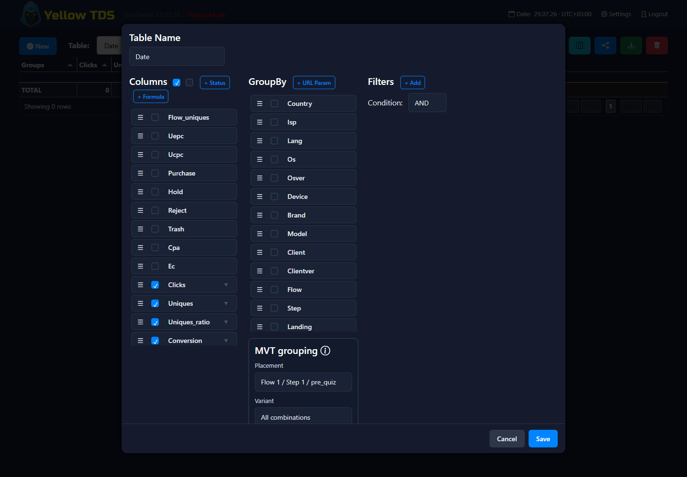
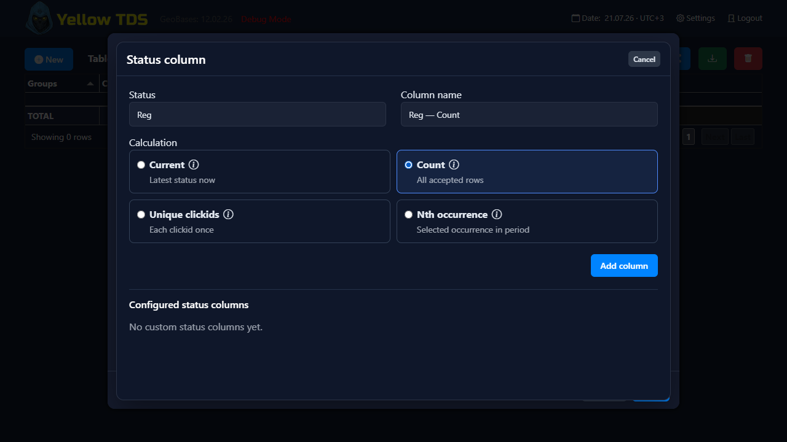

# Статистика

## Что умеет модуль статистики

Статистика кампании позволяет:

- создавать несколько saved tables
- выбирать columns
- настраивать group by
- сохранять filters
- сохранять order by
- экспортировать таблицы в XLSX

## Saved tables

У каждой таблицы есть:

- name
- columns
- groupby
- filters
- orderby
- настройку MVT-группировки

## Группировка MVT

Откройте редактор таблицы кнопкой с иконкой колонок. В разделе **Group By** нажмите **+ MVT**, затем выберите размещение `Flow / Step / Landing`.

- **All combinations** — точная комбинация всех TEST, например `ACB`;
- выключите его, чтобы отметить отдельные TEST. Отмеченные строки можно перетащить в нужный порядок вложенности: TEST1, затем TEST2 даст ветки `A → A/B/C`, а третий выбранный TEST добавит следующий уровень под каждой веткой.

После **OK** MVT появляется как компактный редактируемый элемент **MVT** обычного списка **Group By** и его можно перетаскивать вместе с другими измерениями. Наведите или переведите фокус на иконку информации, чтобы увидеть выбранное размещение `Flow / Step / Landing` и режим TEST; карандаш открывает редактирование, корзина удаляет MVT. Выбранное размещение ограничивает отчёт, поэтому избыточные измерения **Flow**, **Step** и **Landing** автоматически отключаются. Удалите элемент MVT, чтобы снова ими пользоваться.

Комбинации выводятся без разделителей. Если в нумерации TEST есть пропуск, он обозначается дефисом: назначение TEST1=A, TEST2=C, TEST4=B отображается как `AC-B`. Сортировка и агрегация используют исходную JSON-карту, а не эту короткую подпись.

MVT всегда ограничен конкретными campaign, flow, step и landing, поэтому одинаковые TEST разных размещений не смешиваются. Клик учитывается при достижении step. Конверсия относится к MVT каждого step, который пользователь успел достичь к записанному conversion step. Дополнительные impression или pageview-записи не создаются.

## Custom metrics

Можно создавать формульные custom columns и использовать:

- base metrics
- derived metrics

Прежние встроенные Approval, Approval without trash, App, App(t) и связанные sales CR больше не являются специальными метриками. Нужный бизнес-показатель создаётся обычной формулой:

- `App`: `purchase/conversion*100`
- `App(t)`: `purchase/(conversion-trash)*100`

Деление на ноль даёт `0`.

## Колонки Events

События, включённые в разделе настроек кампании [Events](events.md), добавляются кнопкой **+ Event** в редакторе таблицы. Выберите метрику и Calculation в отдельном окне; настроенные Event-колонки остаются в основном списке, а полный набор вариантов не загромождает его. Они выводятся в обычной статистике; для сравнения лендингов используйте иерархию группировки **Flow → Step → Landing**.

При добавлении колонки события можно выбрать один Calculation:

- **Count** — количество записанных измерений
- **Average** — среднее арифметическое записанных значений
- **P75** — 75-й перцентиль
- **Min** — минимальное записанное значение
- **Max** — максимальное записанное значение

Для scroll, visible-time и custom events по умолчанию используется **Count**. Для performance-метрик LCP, INP, CLS, TTFB и FCP по умолчанию используется **P75**. Sum намеренно отсутствует: сумма времени возникновения событий или браузерных измерений не имеет полезного смысла.

P75 считается методом nearest rank: доступные значения сортируются по возрастанию, затем берётся значение с позиции `ceil(0.75 × N)`, при нумерации позиций с единицы. Отсутствующие измерения не участвуют в расчёте. Если в группе нет значений, Count показывает `0`, а Average, P75, Min и Max — `—`.

## Атрибуция конверсий

Общая настройка **Settings → General → Conversion attribution** задаёт один режим для всех таблиц статистики:

- **Click time** относит конверсии и все строки revenue к дате исходного клика.
- **Conversion time** относит initial-конверсии и revenue ко времени каждой принятой строки истории.

Базовая метрика **Conversions** считает только первое появление статуса у clickid. Последующие смены статуса и платные повторы сохраняются в истории, но не увеличивают эту метрику. Campaign timezone из раздела **Misc** управляет группировкой по датам. Верхний selector timezone редактирует это же значение кампании.

## Колонки статусов

Кнопка **+ Status** в редакторе таблицы позволяет выбрать статус кампании и один Calculation:

- **Current** — clickid, у которых последний принятый статус равен выбранному.
- **Count** — все принятые строки истории с этим статусом; один clickid может считаться несколько раз.
- **Unique clickids** — уникальные clickid, у которых статус встречался хотя бы раз.
- **Nth occurrence** — clickid, у которых выбранное по счёту появление статуса попало в период атрибуции.

У каждого Calculation есть отдельный tooltip. Lead, Purchase, Reject и Trash являются обычными пресетами **Current**. В формуле можно использовать токен созданной статусной колонки вместе со встроенными метриками.

Фильтр **Status** всегда работает по последнему статусу. Значение вводится вручную, поэтому удалённый исторический статус по-прежнему можно использовать в сохранённом или новом отчёте.

## Уникальные клики

**Uniques** считает Campaign unique, а **Flow uniques** — уникальные входы по flows и доступен без Group by Flow. **U/C**, **EPuC** и **CPuC** используют Campaign uniques. Старые строки не пересчитываются; для полностью старых и смешанных групп отображается `—`. Подробнее: [Подсчёт уникальности](uniqueness.md).
