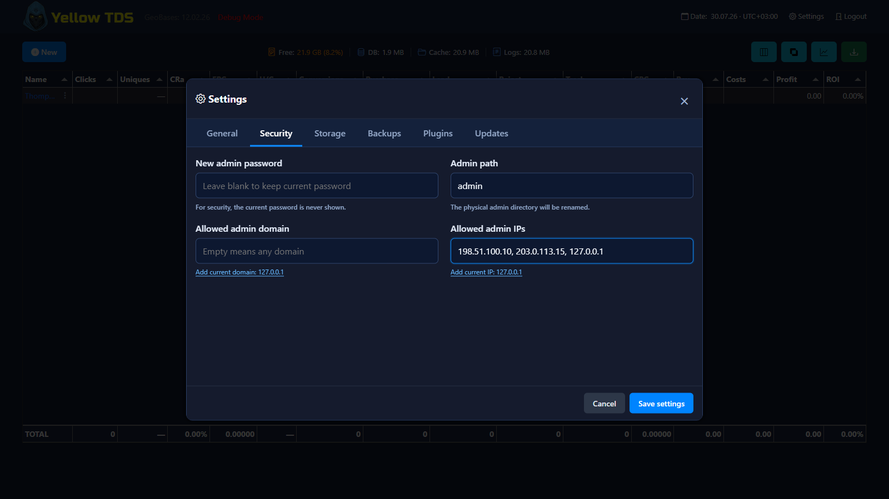

# Системные настройки

Кнопка **Settings** в верхней панели открывает системные настройки TDS. Это настройки всего инстанса, а не отдельной кампании.

## Вкладки

- **General** — UTP, debug mode, срок хранения логов, TDS timezone по умолчанию для новых кампаний и глобальная **Conversion attribution** (`Click time` или `Conversion time`).
- **Security** — новый пароль, путь админки и ограничения доступа по домену/IP.
- **Storage** — имя SQLite-файла, папка резервных копий и корень кэша. Дочерние cache-папки имеют фиксированные системные имена и в интерфейсе не показываются. Кнопка **Randomize main paths** генерирует новые непредсказуемые имена для БД, папки бэкапов и корня кэша; переименование применяется после **Save settings**.
- **Backups** — создание Full-снимков с SQLite и быстрых Quick-снимков без SQLite, а также их просмотр, восстановление и удаление.
- **Plugins** — включение валютных источников и VPN/proxy-детекторов, предпочтительные валюты и режим `any`/`most`.
- **Updates** — проверка и установка обновления YellowTDS и обновление GeoBases.

Selector **TDS timezone** сохраняет IANA-идентификатор и показывает текущее смещение UTC, например `Europe/Samara (UTC+04:00)`. Смещение может меняться по правилам летнего времени.

На вкладке **Security** под полями **Allowed admin domain** и **Allowed admin IPs** показываются определённые сервером текущий домен и IP. В **Allowed admin IPs** можно указать несколько IPv4- и IPv6-адресов в одной строке через запятую, например `198.51.100.10, 203.0.113.15, 2001:db8::10`; доступ разрешается с любого адреса списка. Пустое поле не ограничивает доступ по IP. **Add current IP** дописывает текущий IP через запятую, не добавляет запятую перед первым адресом и не создаёт дубликат. **Add current domain** переносит текущий домен без номера порта. На вкладке **Plugins** каждый плагин имеет явный переключатель и подпись **Enabled** или **Disabled**; параметры выключенного плагина становятся неактивными.

Изменение пути админки, имени БД, папки бэкапов или корня кэша физически переименовывает соответствующие файлы и каталоги. Существующая целевая папка или файл считаются конфликтом и не перезаписываются. После смены пути админки браузер автоматически переходит на новый URL.

## Резервные копии и обновления

**Full backup** включает код системы, `settings.local.php`, загруженные лендинги и white pages, содержимое runtime/cache-папок и согласованный снимок SQLite. **Quick backup** включает те же системные файлы и кэш, но исключает только SQLite. Кнопки имеют поясняющие тултипы, а в списке Full-архив отмечается иконкой базы, Quick — иконкой молнии.

Папка архивов задаётся полем **Backup folder** на вкладке **Storage**. YellowTDS независимо хранит пять новейших Full- и пять новейших Quick-архивов. Full restore заменяет SQLite; Quick restore возвращает файлы, настройки и кэш, сохраняя текущую SQLite-базу. Перед восстановлением создаётся страховочный бэкап того же вида: Full перед Full restore и Quick перед Quick restore. Перед обновлением создаётся Quick backup, поскольку обновления приложения не меняют SQLite.

Создание большого Full backup может выполняться дольше HTTP-таймаута shared hosting. YellowTDS записывает состояние операции на диск и после gateway/network error автоматически проверяет результат вместо немедленного сообщения об ошибке. Если PHP завершился, не опубликовав архив, операция отмечается как прерванная. Через пять минут интерфейс предупреждает о необычно долгом создании, но продолжает проверку, пока активен backup lock.

## Где хранятся значения

`settings.php` содержит дефолты и менеджер настроек. Изменения интерфейса записываются в расположенный рядом `settings.local.php`, который возвращает PHP-массив и ничего не выводит при прямом запуске. База данных для системных настроек не используется.

Текущий пароль никогда не отправляется в браузер. Пустое поле пароля сохраняет прежнее значение, заполненное — заменяет его.

Conversion attribution действует на весь инстанс и не переопределяется в отдельных таблицах. Она меняет только отчёты: Conversion CAP всегда использует время строки конверсии и campaign timezone.

Плагины автоматически обнаруживаются по файлам `*Plugin.php` в `plugins/currency/` и `plugins/vpn/`. Новый плагин появляется выключенным. Если файл плагина удалить, его настройки будут удалены при следующем открытии Settings или сохранении.
