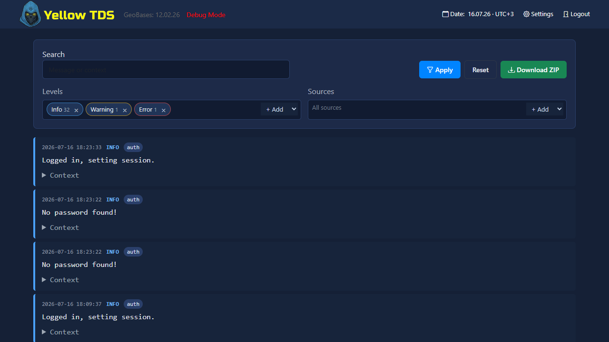

# Тестирование и диагностика

## PHPUnit

Тесты находятся в корневом `tests/`. Из корня репозитория запускаются два набора:

```bash
vendor/bin/phpunit
vendor/bin/phpunit -c tests/application/phpunit.xml
```

## Что покрыто тестами

- flows
- statistics
- Thompson Sampling
- MVT, persistence и rendering
- installer, updater, settings и plugins

## Диагностика

Полезные файлы:

- `tests/engine/check_db.php`
- `tests/tools/phptest.php`
- `tests/load/`

## Серверные журналы

Индикатор **Logs** на главной странице открывает просмотрщик журналов YellowTDS. Вкладка **Server logs** показывает общий поток, а **Postbacks** — структурированный журнал всех входящих postback-ответов и исходящих S2S-попыток. Доступны период до 31 дня, фильтры по уровню и подсистеме, полнотекстовый поиск, постраничная загрузка и скачивание выбранных записей в ZIP.



Новые события записываются в `logs/YYYY-MM-DD.log` в формате JSON Lines. Каждая запись содержит время, уровень (`trace`, `info`, `warning`, `error`), источник и сообщение. `trace` записывается только при включённом Debug mode.

Подробности и расшифровка `Accepted`, `Delivered`, `Failed` и `Sent · response not checked` приведены в разделе [Конверсии и Postbacks](postbacks.md#журнал-postbacks).

Срок хранения задаётся в **Settings → General → Log retention** и по умолчанию равен 30 дням. Автоочистка затрагивает только файлы нового формата. Старые каталоги `logs/<категория>/` не мигрируются и в просмотрщике не отображаются.

Журналы внешнего PHP Connect-клиента создаются на сайте, где установлен клиент, и не передаются в серверный просмотрщик.
