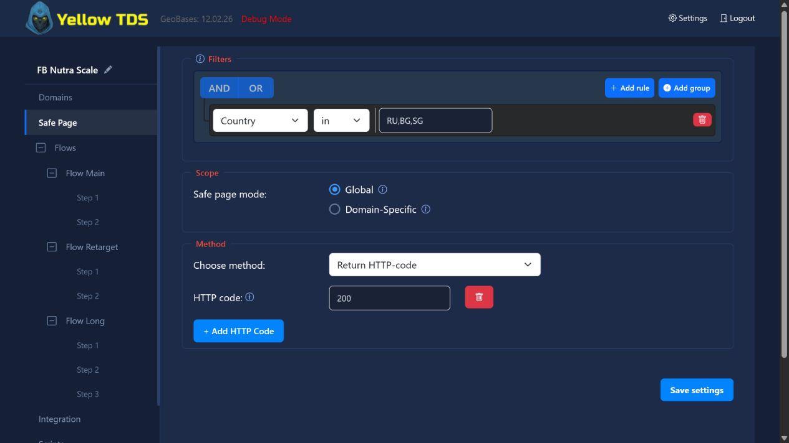
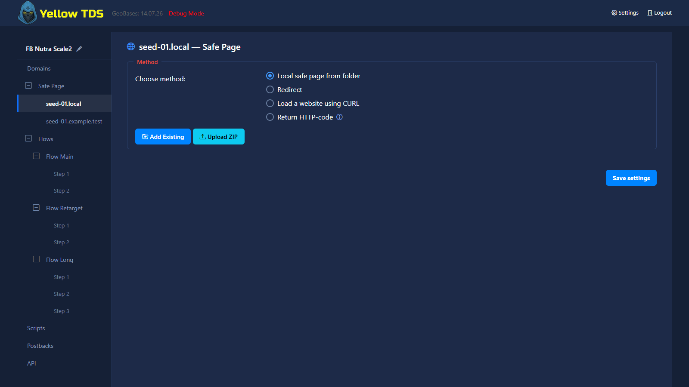

# Настройки Safe Page

## Назначение

Настройки Safe Page определяют, что делать с трафиком, который не должен попадать в offer funnel.

Краткие пояснения к фильтрам, режимам Global/Domain-Specific и HTTP-кодам доступны по значкам `i`: наведите курсор или переведите на значок фокус с клавиатуры.

Подробная расшифровка всех фильтров и формата значений находится в разделе [Формат значений фильтров](black-settings-and-flows.md#формат-значений-фильтров).

## Доступные действия

- local safe page from folder
- redirect
- load a website using CURL
- return HTTP code

В режиме **local safe page from folder** кнопка **Upload ZIP** создаёт новую папку в системном каталоге safe pages. ZIP должен содержать `index.php`, `index.html` или `index.htm` в корне архива либо внутри одной верхней папки. Уже загруженную папку выбирайте через **Add Existing**.

## Global vs domain-specific

Можно выбрать:

- одну общую конфигурацию Safe Page
- отдельную конфигурацию Safe Page для каждого домена

При переключении на **Domain-Specific** домены сразу появляются в боковом меню редактора — сохранять настройки или перезагружать страницу для этого не нужно. Добавление и удаление доменов также немедленно обновляет эти пункты меню.

Dropdown **Method** содержит одинаковые четыре действия и в глобальной настройке, и на странице Safe Page каждого домена. При выборе действия сразу показываются только относящиеся к нему поля.

## Load modes

Для folder и некоторых других вариантов используются режимы загрузки:

- base
- rewrite
- direct
